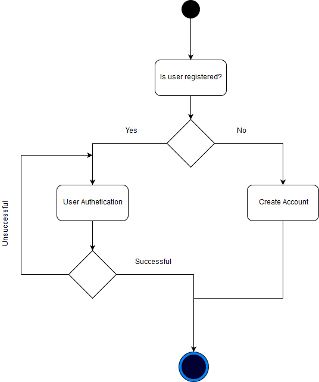
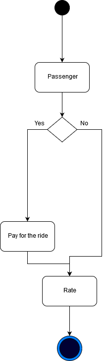
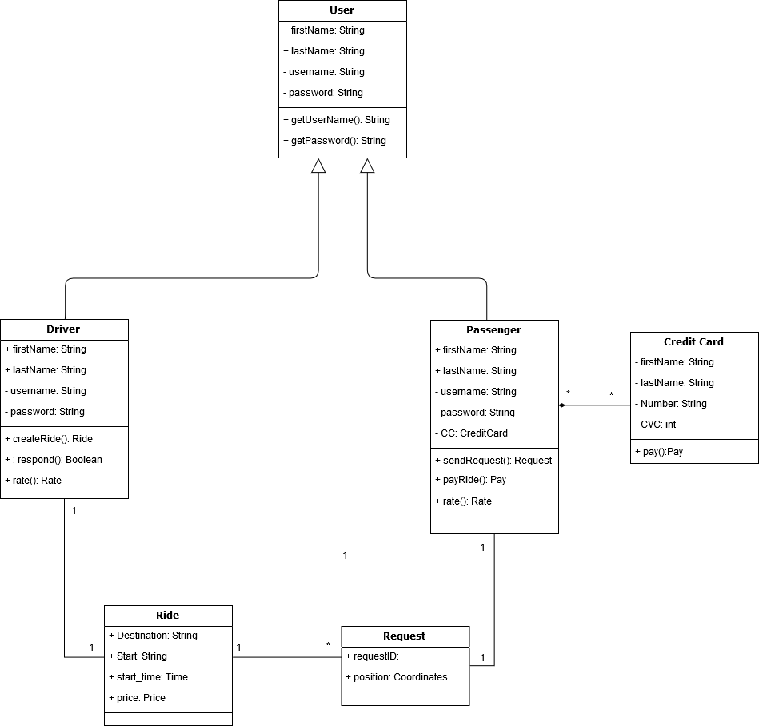

# ΤΕΧΝΟΛΟΓΙΑ ΛΟΓΙΣΜΙΚΟΥ

## R2  Απαιτήσεις λογισμικού / Ανάλυση συστήματος

*Βασίλης Μόρμορης 3140122* 
*Νικόλαος-Αριστοτέλης Πατεράκης 3160140*  

**2.1.1) Use case diagram**  

  
**2.1.2) Περιγραφή  περιπτώσεων  χρήσης**   

Η εγγραφή στο σύστημα δίνει τη δυνατότητα σε ένα χρήστη, που δεν είναι μέλος στην εφαρμογή και δεν έχει ξανασυνδεθεί, να κάνει εγγραφή, ώστε να χρησιμοποιήσει τις υπηρεσίες που προσφέρει η εφαρμογή. Η αυθεντικοποίηση χρήστη αφορά τον ήδη εγγεγραμμένο χρήστη, ο οποίος έχει σκοπό να ξαναχρησιμοποιήσει την εφαρμογή διατηρώντας τα δεδομένα και τις πληροφορίες του, ώστε να μην επαναλάβει τη διαδικασία δίνοντας τις απαραίτητες πληροφορίες που χρειάζεται η εφαρμογή. Η δημιουργία και γνωστοποίηση της διαδρομής από τον οδηγό είναι απαραίτητη και ο κύριος μηχανισμός της εφαρμογής εξαρτάται από αυτό. Ο οδηγός, που είναι χρήστης, γνωστοποιώντας ότι θα πραγματοποίησει μια διαδρομή προσθέτει κίνηση στη «λιστα» της εφαρμογής με τις διαδρομές. Δημιουργία αιτήματος συμμετοχής στη διαδρομή από τον πεζό γίνεται αφότου ο πεζός,  που είναι και αυτός χρήστης, δει στη λίστα κάποια διαδρομή που τον ενδιαφέρει και θέλει να ενημερώσει τον οδηγό ότι τον ενδιαφέρει να επιβιβαστεί. Απάντηση (αποδοχή ή απόρριψη) του αιτήματος του πεζού από τον οδηγό είναι ένα μήνυμα/ειδοποίηση που ενημερώνει τον επιβάτη για το αν το αίτημα του έγινε αποδεκτό ή όχι. Μετά την ολοκλήρωση της διαδικασίας γνωστοποίησης και συμπήρωσης των θέσεων ενημερώνεται ο οδηγός για τα σημεία παραλαβής των συνεπιβατών του, ώστε να ξέρει τι ώρα να ξεκινήσει και από ποια μέρη να περάσει ώστε να επιβιβαστούν όλους όσους δέχτηκε. Στο τελος της διαδρομής οι επιβάτες θα πρέπει να πληρώσουν. Δεν είναι ανάγκη η πληρωμή να γίνει εκείνη τη στιγμή καθώς η εφαρμογή δίνει ένα χρονικό περιθώριο για λόγους εξυπηρέτησης πελατών αλλά και σε περίπτωση που ο server είναι προσωρινά μη διαθέσιμος ή δεν υπάρχει σύνδεση στο internet. Μετά την ολοκλήρωση της διαδρομής οι επιβάτες αξιολογούν τον οδηγό βάση κριτηρίων και ο οδηγός θα αξιολογεί τους συνεπιβάτες του βάση κάποιων άλλων κριτιρίων, έτσι ώστε οι καλύτεροι χρήστες να είναι πιο επιθυμητοί. Τέλος, η εφαρμογή θα πρέπει να δίνει στον οδηγό το ποσό που του αναλογεί αφότου επιβεβαιωθεί η διαδρομή.

 

**2.1.3) Activity Diagrams** 

  

* Αυθεντικοποίηση χρήστη  
 
* Δημιουργία/Επιλογή διαδρομής  
  
* Δημιουργία αιτήματος/Εγγραφή χρήστη  
  
* Αξιολόγηση  
  

**2.2)  Μη Λειτουργικές απαιτήσεις**   

Η ασφάλεια και η ταχύτητα αυθεντικοποίησης είναι σημαντική για τους χρήστες. Η αίσθηση ότι ο λογαριασμός είναι ασφαλής βοηθαέι τον χρήστη να εμπιστευτεί την εφαρμογή, ενώ η ταχύτητα ταυτοποίησης του χρήστη και επαλήθευσης του κωδικού τον ωθεί στη τακτική χρήση. 
Επίσης όσο user friendly είναι το περιβάλλον τόσο πιο ελκυστική θα είναι η εφαρμογή, ενώ ταυτόχρονα θα χρησιμοποιείται σωστά χωρίς περιθώρια παρεξηγήσεων ή απατών. 
Τέλος, σημαντικό είναι ακόμα είναι οι αξιολογήσεις να φαίνονται ανώνυμες στους άλλος χρήστες της εφαρμογής, ώστε να μην υπάρχει φόβος να γράψει κάποιος μία κακή κριτική επειδή δεν έμεινε ικανοποιημένος. 

**2.3.1) Domain Model**  

**2.3.2) Sequence Diagram**  

